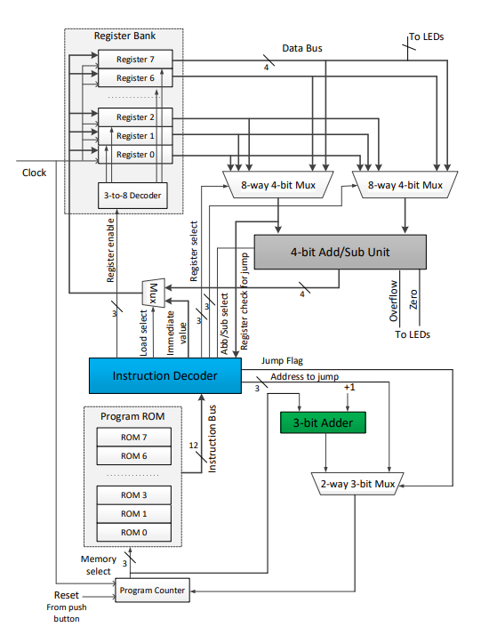

# 4-bit Nanoprocessor Design

This project implements a simple 4-bit nanoprocessor as part of the Computer Organization and Digital Design module in semester 2 of Computer Science and Engineering at the University of Moratuwa.

## Project Overview

The nanoprocessor is designed to execute a set of 4 instructions:

1. MOVI - Move immediate value to register
2. ADD - Add values in two registers
3. NEG - 2's complement of a register
4. JZR - Jump if register value is zero

## High-Level Diagram

## Key Components

- 4-bit Add/Subtract unit
- 3-bit adder for Program Counter
- 3-bit Program Counter
- Register Bank (8 4-bit registers)
- Program ROM
- Instruction Decoder
- Various multiplexers (2-way 3-bit, 2-way 4-bit, 8-way 4-bit)

## Features

- 4-bit data processing
- 3-bit program counter
- 12-bit instruction format
- Ability to perform basic arithmetic and control flow operations

## Implementation

The nanoprocessor is implemented using VHDL and designed to run on a BASYS 3 FPGA board.

## Usage

1. Clone this repository
2. Open the project in your preferred VHDL IDE (e.g., Vivado)
3. Synthesize and implement the design
4. Program the BASYS 3 board with the generated bitstream
5. Use the onboard switches and buttons to input data and control the processor
6. Observe the results on the LED outputs and 7-segment display

## Team Members

- https://github.com/pererabsdt
- https://github.com/SithumBimsara20030113
- https://github.com/KaveeshaKapuruge
- https://github.com/jayasinghesasmitha

